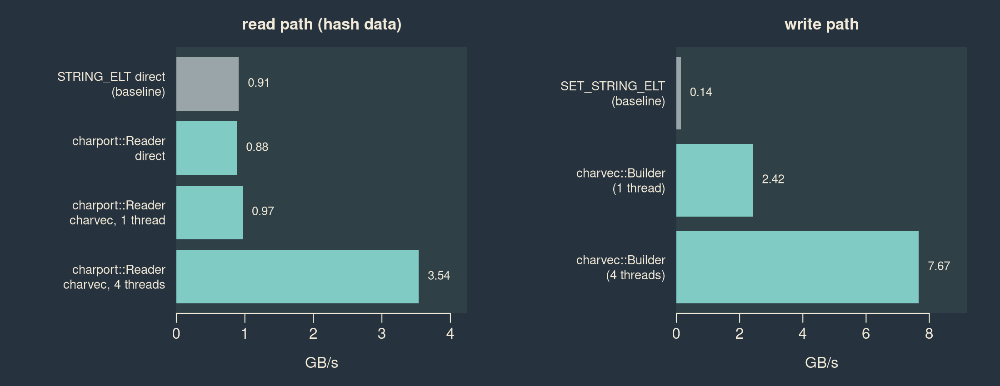

# charport


[](https://github.com/charport/charport/actions)

`charport` is an interconnect for ALTREP character vector backends. It
gives compiled R packages one way to read character vectors, whether the
input is a plain `STRSXP`, a `charport::charvec`, or another package’s
registered ALTREP string class.

The interface has three parts:

1.  Backend packages register an ALTREP class with a per-vector state
    lookup and a per-element byte-view accessor.
2.  Consumer packages call `charport_resolve()` or the C++ wrapper
    `charport::Reader`.
3.  Registered, unmaterialized backends are read zero-copy; everything
    else uses a direct fallback over ordinary `CHARSXP`s.

`charport` also ships `charvec`, a reference ALTREP character vector
backed by native byte slices, plus serial and sharded builders for
constructing `charvec` objects without first creating `CHARSXP`s.

The ABI is still pre-release. A layout or contract change will bump
`CHARPORT_ABI_VERSION`; downstream packages should call
`charport::check_abi()` in their load hook.

## Performance snapshot

The benchmark below uses the enwik8 corpus split into 1.13 million
strings (94 MB of string data). It compares the ordinary `STRING_ELT` /
`SET_STRING_ELT` paths with `charport::Reader` and the `charvec`
builders. The read benchmark explicitly registers `charvec` as a
reference backend; normal package load leaves the backend registry empty
until backend packages opt in.



## Installation

``` r
pak::pak("charport/charport")
```

## R interface

The R API is small and mainly diagnostic:

``` r
library(charport)

x <- charvec("hello", "world", NA)
typeof(x)
#> [1] "character"
is_charvec(x)
#> [1] TRUE
as.character(x)
#> [1] "hello" "world" NA

charport_backends()
#> $n
#> [1] 0
#>
#> $reentrant
#> logical(0)
charport_backend_of(x)
#> [1] NA
```

`charvec` preserves bytes and encoding marks as supplied. It is not an
encoding normalization layer; translation belongs in the package that
understands the operation being performed.

`charvec` itself is not registered with the broker on package load. It is
a reference storage class and builder target; backend packages that want
to serve their own ALTREP classes register those classes explicitly.

## Consumer example

A C++ consumer includes `charport.h`, constructs a reader on the main R
thread, and then loops over `charport::StrView` values:

``` cpp
#include "charport.h"

extern "C" SEXP C_total_bytes(SEXP x) {
  charport::Reader r(x);
  double total = 0;
  for(charport::StrView v : r) {
    if(!v.is_na()) total += v.len;
  }
  return Rf_ScalarReal(total);
}
```

The reader borrows `x`. Keep `x` protected and do not touch it or any
alias through the R API while the reader or a returned view is in use.
ALTREP classes control their own materialization and storage lifetime,
so R access may invalidate the borrowed pointers.

## Builder example

The serial builder copies supplied bytes into a new `charvec`:

``` cpp
charport::charvec::Builder b(n);
for(R_xlen_t i = 0; i < n; ++i) {
  b.set(i, ptr, len, charport_enc::CE_UTF8);
}
SEXP out = b.to_charvec();
```

For parallel construction, `charport::charvec::BuilderMT` gives each
worker a shard. Workers may call `set()` or `reserve()` concurrently
when shard indices and element ranges are disjoint; `to_charvec()` runs
on the main R thread after the join.

## Documentation

- `vignette("charport", package = "charport")` is the quick package
  tour.
- `vignette("developer-guide", package = "charport")` is the interface
  contract for backend and consumer package authors.

Development of `charport` is funded by the R Consortium through an
Infrastructure Steering Committee grant.
