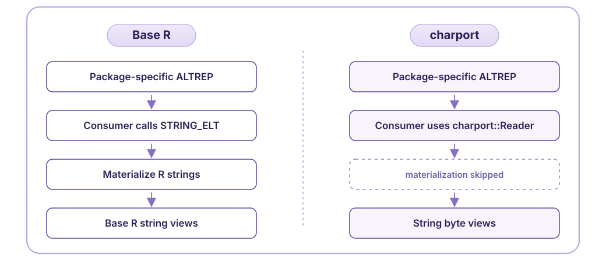
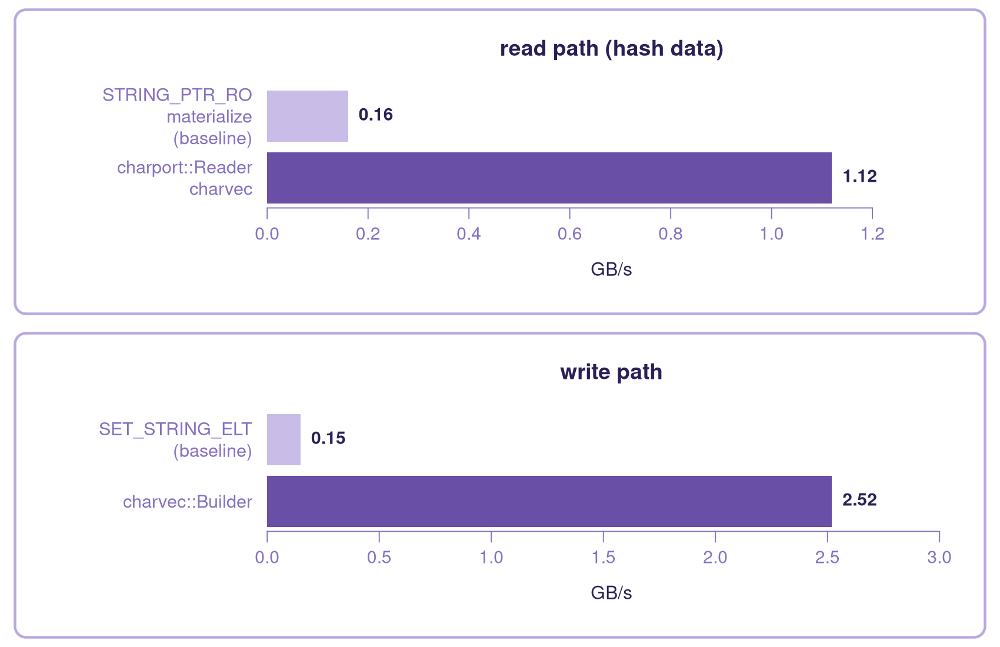

::: {.content-visible when-format="gfm"}

:::

## Universal ALTREP interoperability for strings

R's ALTREP system lets packages represent string data more efficiently, and many packages use it internally. But when data crosses a package boundary, ALTREP vectors are usually *materialized* back into plain R strings, and that step can dominate the cost of the whole operation.

The goal of `charport` is to remove that materialization cost by making ALTREP strings interoperable between packages. On the benchmark below, the difference is roughly an order of magnitude. The hope is that ALTREP strings stop being a package-local optimization and become something packages share.

*The work in this package is funded by the R Consortium Infrastructure Steering Committee.*

## ALTREP String Access

The diagram below shows the default path and the `charport` path side by side.

::: {.content-visible when-format="gfm"}

:::

::: {.content-visible when-format="html"}

:::

The benchmark below runs these paths on real string data and asks a simple question: what is skipping materialization worth?

The benchmark uses the `enwik8` dataset. The read baseline is `STRING_PTR_RO` over an unmaterialized `charvec` (a built-in ALTREP class). The `charport::Reader` paths read the same data without materialization.

On the write path, writing standard R strings via `SET_STRING_ELT` is the baseline, compared to writing the same data to `charvec`.

For ordinary materialized R character vectors, `Reader` falls back to standard R storage. This path is meant to preserve correctness without a large penalty. On the benchmark run used for the plot, `Reader` range length access over a base R vector took 8.77 ms, compared with 7.62 ms for direct `STRING_PTR_RO` length access.

::: {.content-visible when-format="gfm"}

:::

::: {.content-visible when-format="html"}

:::

For an unmaterialized ALTREP source, reading the data where it already lives is simply faster, and the gap is large enough to matter in everyday string work.

## A Broker for ALTREP Strings

`charport` acts as a small broker for ALTREP strings:

1.  A package registers the ALTREP string class it owns via `register_altrep`.
2.  A consumer package accesses string data through `charport::Reader`.
3.  Registered ALTREP classes can be read directly; ordinary vectors and unregistered ALTREP classes fall back to standard R behavior.

`charport` does not take a stance on string interpretation, string semantics, locale policy, or normalization. Its role is only to offer a low-level agreement that lets packages interoperate safely.

## charvec: a fast general-purpose ALTREP character vector

`charport` also includes `charvec`, a fast general-purpose ALTREP class. Internally, `charvec` stores string data in data blocks alongside a vector of metadata.

To R, a `charvec` behaves like an ordinary character vector. In compiled code, a `charvec` can be constructed efficiently with optional multithreading, and data can be read back through `charport::Reader` without materialization.

That makes it useful both as a reference implementation and as an output class for packages that want efficient ALTREP strings.

## For Package Developers

Package authors can use `charport` from either side of the interface.

ALTREP string classes can register via `register_altrep`. Packages with heavy string workflows can use `charvec` directly, or read through `charport::Reader` and get a direct path to ALTREP data.

The package developer guide covers registration, reading, fallback behavior, pointer lifetime, thread safety, and the `charvec` builder.

::: {.content-visible when-format="gfm"}
- [Package developer guide](https://charport.github.io/charport/articles/developer-guide.html), also listed by `utils::vignette(package = "charport")`.
- [Design rationale](https://charport.github.io/charport/articles/design-rationale.html), for an explanation of design choices in this package.
:::

::: {.content-visible when-format="html"}
- [Package developer guide](developer-guide.html), also listed by `utils::vignette(package = "charport")`.
- [Design rationale](design-rationale.html), for an explanation of design choices in this package.
:::
