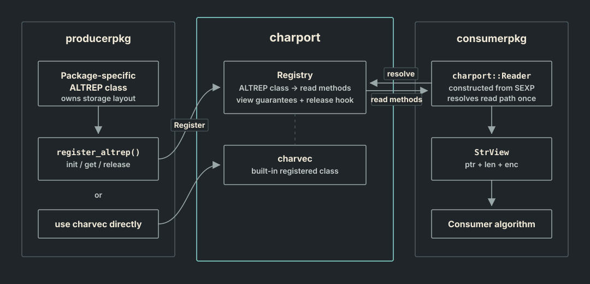

## Overview

This guide is for packages that read ALTREP character vectors, register an ALTREP string class, or build `charvec` output.

`charport` defines an interface between ALTREP string producers and consumers. Producers register a way to view their string data, and consumers read those views without depending on the producer's storage layout or forcing ordinary R string materialization.

A package may produce an ALTREP string class, consume ALTREP strings, or use `charvec` as its output representation. The diagram below shows how those roles meet through `charport`.



The guide covers three use cases:

- [Using `Reader`](#universal-reader): read ALTREP strings through one C++ interface.
- [Registering an ALTREP class](#altrep-registration): make an ALTREP string class readable by other packages through `charport`.
- [Using `charvec` directly](#charvec-direct): build the included `charvec` class with serial or multithreaded builders.

Each use case starts by linking to `charport` and including the appropriate header.

## Linking to `charport` {#linking-to-charport}

Include the header for the way R enters your code:

| Entry point | Header |
|---|---|
| Hand-written `.Call` | `charport.h` |
| Rcpp generated wrapper | `charport/rcpp.h` |
| cpp11 generated wrapper | `charport/cpp11.h` |

The Reader and Builder APIs are the same with all three headers.

In `DESCRIPTION`, declare both the runtime dependency and the header dependency:

``` text
Imports:
    charport
LinkingTo:
    charport
```

In `NAMESPACE`, import `charport` so its runtime entry points are available:

### Namespace setup

::: panel-tabset
#### roxygen2

``` r
#' @useDynLib yourpkg, .registration = TRUE
#' @import charport
"_PACKAGE"
```

#### NAMESPACE

``` text
useDynLib(yourpkg, .registration = TRUE)
import(charport)
```
:::

## Using `Reader` {#universal-reader}

`charport::Reader` reads string data from an ALTREP class or an ordinary R character vector.

For a registered ALTREP class, `Reader` gives you non-materializing read-only views. For other cases, such as a plain vector, a materialized ALTREP, or an unregistered ALTREP, `Reader` falls back to ordinary access via `STRING_PTR_RO`.

A `Reader` gives you a read-only view of the vector's current storage. Keep it as a stack object and let its destructor clean up any state supplied by the registered class.

For a hand-written `.Call` entry point, put the work inside `r_boundary()`.
The boundary lets R errors run C++ destructors before the original R condition
continues:

``` cpp
extern "C" SEXP C_copy_strings(SEXP x) {
  return charport::r_boundary(
    "copy_strings",
    [&]() -> SEXP {
      charport::Reader input(x);
      charport::charvec::Builder output(input.size());
      for(R_xlen_t i = 0; i < input.size(); ++i) {
        output.set(i, input[i]);
      }
      return output.to_sexp();
    }
  );
}
```

Create the boundary before any C++ object that needs cleanup. Reader
initialization and final Store wrapping are protected internally. Use
`charport::unwind_protect()` around other narrow calls that may enter R, such as
evaluation, allocation, warnings, or interrupt checks. Rcpp and cpp11 generated
wrappers provide the outer boundary automatically; see
[Error handling](error-handling.qmd) for the three entry styles.

The main access pattern is contiguous range access. Construct a `Reader`, ask for the 0-based range you want, and let `Reader` fill the output.

``` cpp
using namespace charport;

Reader r(robj);
const R_xlen_t n = r.size();

ByteViews byteviews(n);
r.byteviews(0, n, byteviews);

const char ** ptrs = byteviews.ptrs();
int * lens = byteviews.lengths();

for(R_xlen_t i = 0; i < n; ++i) {
  if(lens[i] != NA_INTEGER) {
    const char * ptr = ptrs[i];
    int len = lens[i];
    // use ptr and len
  }
}
```

Missing strings are reported as `ptr = nullptr` and `len = NA_INTEGER`. String pointers are not guaranteed to be null-terminated, so always use the reported length.

There are several different access methods:

- `r.views(start, size, StrViews&)` fills a `StrViews` struct that contains three arrays: `const char *` pointers, `int` byte lengths, and `cetype_ext_t` encoding marks. `view(i)` returns one `StrView` struct with `ptr`, `len`, and `enc` fields.
- `r.byteviews(start, size, ByteViews&)` fills a `ByteViews` struct that contains two arrays: `const char *` pointers and `int` byte lengths. `byteview(i)` returns one `ByteView` with `ptr` and `len` fields.
- `r.lengths(start, size, int*)` fills an `int` array with byte lengths, using `NA_INTEGER` for missing strings.
- `r.encodings(start, size, cetype_ext_t*)` fills a `cetype_ext_t` array with encoding marks, using `cetype_ext_t::CE_NA` for missing strings. More on encoding definitions later.

### Scalar reader access

Scalar methods are convenience functions for single-element reads. For example, to read the first element:

``` cpp
Reader r(robj);
StrView s = r.view(0);
if(!s.is_na()) {
  // s.ptr, s.len, s.enc
}
```

`r.byteview(i)`, `r.length(i)`, and `r.encoding(i)` return the narrower scalar forms. `operator[]` is an alias for `r.view(i)`.

### Indexed reader access

Indexed access gathers arbitrary 0-based positions into output arrays. The output order matches the index order:

``` cpp
Reader r(robj);
R_xlen_t idx[] = {0, 10, 20};
const R_xlen_t len = 3;

ByteViews byteviews(len);
r.byteviews(&idx[0], len, byteviews); // outputs elements 0, 10 and 20
```

### Encoding

`charport` passes through the same string encoding information available from base R strings. It does not translate, normalize, or reinterpret bytes; it only makes the encoding mark available alongside each pointer and byte length.

Encoding marks use `cetype_ext_t`, a one-byte enum:

| Value | Meaning |
|------------------------------------|------------------------------------|
| `cetype_ext_t::CE_NATIVE` | Native encoding based on machine locale. |
| `cetype_ext_t::CE_UTF8` | UTF-8. |
| `cetype_ext_t::CE_LATIN1` | Latin-1. |
| `cetype_ext_t::CE_BYTES` | Bytes encoding. |
| `cetype_ext_t::CE_ASCII_OR_UTF8` | ASCII/UTF-8-compatible bytes. |
| `cetype_ext_t::CE_ASCII` | ASCII bytes, equivalent to `Rf_charIsASCII(x)`. |
| `cetype_ext_t::CE_NA` | Missing string. `ptr` is `NULL` and `len` is `NA_INTEGER`. |

`CE_ASCII_OR_UTF8`, `CE_ASCII`, and `CE_NA` extend R's `cetype_t` values. `CE_ASCII` records the result of `Rf_charIsASCII()`, and `CE_NA` carries missingness alongside the pointer and length. `CE_ASCII_OR_UTF8` lets a producer report bytes that fit either case when distinguishing them early would repeat base R's ASCII check.

The ordinary `cetype_t` values correspond directly to the first four `cetype_ext_t` values, so a `static_cast` preserves R's encoding mark when you already have a `cetype_t`:

``` cpp
cetype_ext_t enc = static_cast<cetype_ext_t>(Rf_getCharCE(x));
```

That cast preserves the encoding marks for native, UTF-8, Latin-1 and byte strings.

### Reader lifetime and multithreading

In Rust terms, a `Reader` acts like a strict borrow. It is a temporary view of the vector's current string storage, valid only while that storage remains protected and unmodified.

While the `Reader` is active, do not access or modify the original R object's character data. Calls such as `STRING_ELT`, `STRING_PTR_RO`, and `DATAPTR_RO` can invalidate the borrow. Attributes may still be handled as long as doing so does not force or modify the character data.

When `persistent_views()` is true, byte pointers returned from the `Reader` remain valid after later `Reader` access, until the active borrow ends.

When `concurrent_access()` is true, `Reader` access itself may happen off the main thread and concurrently. `reentrant()` returns true only when both `persistent_views()` and `concurrent_access()` are true.

The fallback `Reader` path (e.g. on ordinary R strings) has `persistent_views()` but not `concurrent_access()`.

## Registering an ALTREP class {#altrep-registration}

A package can register its ALTREP class to make non-materializing access available to `charport::Reader`. Registration can happen directly in package initialization, or from `.onLoad()`.

The registration function has the following signature:

``` cpp
void charport::register_altrep(
  R_altrep_class_t cls,
  charport_reader_state_fns state_fns,
  charport_reader_range_fns range_fns,
  charport_reader_index_fns index_fns,
  charport_reader_capabilities capabilities
);
```

The grouped structs are plain C structs:

``` cpp
struct charport_reader_state_fns {
  charport_reader_init_fn init;
  charport_reader_release_fn release;
};

struct charport_reader_range_fns {
  charport_reader_strviews_range_fn strviews;
  charport_reader_byteviews_range_fn byteviews;
  charport_reader_lengths_range_fn lengths;
  charport_reader_encodings_range_fn encodings;
};

struct charport_reader_index_fns {
  charport_reader_strviews_index_fn strviews;
  charport_reader_byteviews_index_fn byteviews;
  charport_reader_lengths_index_fn lengths;
  charport_reader_encodings_index_fn encodings;
};

struct charport_reader_capabilities {
  bool persistent_views;
  bool concurrent_access;
};
```

`init(SEXP x)` starts the borrow and returns the state that the reader callbacks need. When `release` is `NULL`, the ALTREP object retains ownership of that state. Otherwise, `Reader` calls `release` when the borrow ends.

Returning `NULL` from `init` means this particular vector cannot satisfy the reader contract, so `charport` falls back to `STRING_PTR_RO`.

The access structs have one callback function for each `Reader` method. Range callbacks fill output arrays for the 0-based interval `[start, start + size)`.

``` cpp
void range_strviews(void * state, R_xlen_t start, R_xlen_t size,
                    const char ** out_ptrs, int * out_lens,
                    cetype_ext_t * out_encs);

void range_byteviews(void * state, R_xlen_t start, R_xlen_t size,
                     const char ** out_ptrs, int * out_lens);

void range_lengths(void * state, R_xlen_t start, R_xlen_t size,
                   int * out_lens);

void range_encodings(void * state, R_xlen_t start, R_xlen_t size,
                     cetype_ext_t * out_encs);
```

Indexed callbacks fill output for given 0-based indices. The indexed forms have the same output arguments, but replace `start` with `const R_xlen_t * indices`.

Missing strings should be reported as `ptr = nullptr`, `len = NA_INTEGER`, and `enc = cetype_ext_t::CE_NA`.

### Registration location

::: panel-tabset
#### .onLoad hook registration example

An `.onLoad` hook can call a small native registration routine.

``` cpp
extern "C" SEXP C_register_yourpkg_altrep(void) {
  charport::register_altrep(
    your_altrep,
    charport_reader_state_fns{reader_init, nullptr},
    charport_reader_range_fns{
      range_strviews,
      range_byteviews,
      range_lengths,
      range_encodings
    },
    charport_reader_index_fns{
      index_strviews,
      index_byteviews,
      index_lengths,
      index_encodings
    },
    charport_reader_capabilities{true, true}
  );
  return R_NilValue;
}

extern "C" SEXP C_unregister_yourpkg_altrep(void) {
  charport::unregister_altrep(your_altrep);
  return R_NilValue;
}
```

``` r
.onLoad <- function(libname, pkgname) {
  .Call(C_register_yourpkg_altrep)
}

.onUnload <- function(libpath) {
  .Call(C_unregister_yourpkg_altrep)
}
```

#### Init hook registration example

Native package initialization is the usual registration point.

``` cpp
static R_altrep_class_t your_altrep;

extern "C" void R_init_yourpkg(DllInfo * dll) {
  // Other init hook operations
  // ...
  your_altrep = R_make_altstring_class("yourclass", "yourpkg", dll);
  charport::register_altrep(
    your_altrep,
    charport_reader_state_fns{reader_init, nullptr},
    charport_reader_range_fns{
      range_strviews,
      range_byteviews,
      range_lengths,
      range_encodings
    },
    charport_reader_index_fns{
      index_strviews,
      index_byteviews,
      index_lengths,
      index_encodings
    },
    charport_reader_capabilities{true, true}
  );
}

extern "C" void R_unload_yourpkg(DllInfo * dll) {
  charport::unregister_altrep(your_altrep);
  (void)dll;
}
```

Rcpp and cpp11 initialization hooks can perform the same registration.
:::

### R and C++ errors

`Reader` construction and Builder wrapping use the adapter selected by the
umbrella header. Hand-written `.Call` functions also need `r_boundary()` around
their body; Rcpp and cpp11 generate that outer boundary themselves.

Provider `init` callbacks and worker threads have separate rules. The short
[Error handling](error-handling.qmd) guide explains all three cases.

## Using `charvec` directly {#charvec-direct}

`charvec` is `charport`'s included ALTREP string class. Packages can use it as an output representation without implementing another ALTREP backend.

Each `charvec` has a native `charvec::Store` behind its R external pointer. The store owns two things:

1.  `SliceChain`, a linked list holding large contiguous slices of bytes that represent the string data.
2.  `RecordTable`, which stores pointers into the `SliceChain`, string lengths, and encodings.

The conceptual shape is:

``` cpp
class Store {
  SliceChain slices;
  RecordTable records;
};

class RecordTable {
  std::unique_ptr<const char *[]> ptrs;  // one pointer per string
  std::unique_ptr<int[]> lens;           // length of each string
  std::unique_ptr<cetype_ext_t[]> encs;  // encoding of each string
  size_t vector_length;                  // vector length
};
```

For non-empty strings, `ptrs[i]` points into one of the byte slices. Empty strings point at shared empty storage. Missing strings are stored as `ptrs[i] = nullptr`, `lens[i] = NA_INTEGER`, and `encs[i] = cetype_ext_t::CE_NA`.

### Constructing a `charvec` with `charvec::Builder`

`charvec::Builder` builds a `charvec` serially, one string at a time. The constructor takes the vector length, and byte slices are created as strings are written. Each automatically managed slice is one allocation: a small typed header for the next-slice link, followed immediately by string bytes. For multi-string vectors, the initial slice size scales with vector length and is capped at 16 KiB. Later slices grow to half the bytes already allocated, rounded to 64-byte boundaries, with a 256 KiB per-slice cap.

For one-element output, `charvec::build_scalar()` is the smallest helper:

``` cpp
SEXP out = charvec::build_scalar(view);
```

Like the builder `to_sexp()` methods, call it on the main R thread.

A string can be inserted into a builder with either `set()` or `reserve()`.

Use `set()` to copy an existing buffer.

``` cpp
charvec::Builder b(n);
b.set(i, ptr, len, cetype_ext_t::CE_UTF8);
```

Use `reserve()` when the output bytes can be written directly into the store:

``` cpp
char * dst = b.reserve(i, len, cetype_ext_t::CE_UTF8);
// write to dst directly
```

`to_sexp()` returns the ALTREP R vector. Call `reset()` to reuse the builder.

``` cpp
SEXP out = b.to_sexp();
b.reset(n);
```

### Constructing a `charvec` with `charvec::ParallelBuilder`

Use `charvec::ParallelBuilder` for parallel construction. The builder owns a fixed set of shards. Each worker uses a distinct shard index with `set()` or `reserve()`. `to_sexp()` combines the shards on the main thread.

``` cpp
charvec::ParallelBuilder b(n, n_workers);

// worker_id is 0 .. n_workers-1
parallel_for_each_worker(worker_id, n_workers) {
  R_xlen_t begin = n * worker_id / n_workers;
  R_xlen_t end = n * (worker_id + 1) / n_workers;

  for(R_xlen_t i = begin; i < end; ++i) {
    char * dst = b.reserve(worker_id, i, len[i], cetype_ext_t::CE_UTF8);
    // write this worker's bytes into dst
  }
}

SEXP out = b.to_sexp();
```

### Constructing a `charvec` with `charvec::DirectBuilder`

`charvec::DirectBuilder` is for advanced cases where the total byte size is known or the caller needs to control slice growth. It exposes slice data and metadata arrays directly, so the caller must keep every pointer, length, encoding, and slice consistent.

``` cpp
charvec::DirectBuilder b(n, total_bytes);

char * data = b.data_slice(0); // 0 is the index of the slice
const char ** ptrs = b.ptrs();
int * lens = b.lengths();
cetype_ext_t * encs = b.encodings();

std::memcpy(data, src, total_bytes);
ptrs[0] = data + offset0;
lens[0] = len0;
encs[0] = cetype_ext_t::CE_UTF8;

ptrs[1] = nullptr;
lens[1] = NA_INTEGER;
encs[1] = cetype_ext_t::CE_NA;

SEXP out = b.to_sexp();
b.reset(n, total_bytes);
```

`allocate_next_slice(bytes)` allocates another slice and returns its data pointer.

## Summary checklists

### Using `Reader`

1.  Construct `Reader` objects on the main R thread.
2.  Prefer range access for large vectors.
3.  Use scalar access only when the algorithm is naturally element-wise.
4.  Respect the borrow rule: no R access to the source vector or aliases during active reads.
5.  Call `Reader` access from worker threads only when `r.concurrent_access()` is true.

### Registering an ALTREP class

1.  Register in `R_init_yourpkg()` and unregister in `R_unload_yourpkg()`.
2.  Return `NULL` from `init()` when a specific vector instance cannot satisfy the `Reader` contract.
3.  Make range, indexed, and release callbacks free of R API and exceptions for valid indices.
4.  Set `persistent_views = true` when returned views remain valid until the borrow ends.
5.  Set `concurrent_access = true` when concurrent access calls are safe.

### Using `charvec` directly

1.  Use `charvec::build_scalar()` for one-element output.
2.  Use `charvec::Builder` for ordinary serial construction.
3.  Use `charvec::ParallelBuilder` for parallel construction.
4.  Use `charvec::DirectBuilder` only when you need to manage slices and metadata directly.
5.  Store missing values as `ptr = nullptr`, `len = NA_INTEGER`, and `enc = cetype_ext_t::CE_NA`.
6.  Call `to_sexp()` only after all writes are complete, and on the main R thread.

## Optional ABI compatibility guard {#abi-compatibility-guard}

If a future `charport` release changes a layout or contract, the compiled ABI version will change. Packages built against an older ABI can use `check_abi()` at load time and report a mismatch before using the interface.

The current ABI version is `CHARPORT_ABI_VERSION=1`. `check_abi()` returns `false` when the value compiled into `yourpkg` does not match the value provided by the installed `charport`.

### ABI check hook examples

Framework init attributes are called directly from `R_init_*`; they do not use
the generated `.Call` exception wrapper. These checks run before creating C++
state and therefore report a mismatch directly to R.

::: panel-tabset
#### Manual `.onLoad`

``` cpp
#include "charport.h"

extern "C" SEXP C_check_charport_abi(void) {
  return Rf_ScalarLogical(charport::check_abi() ? TRUE : FALSE);
}
```

Register `C_check_charport_abi` in the package's `.Call` table. To stop package loading on a mismatch, add:

``` r
.onLoad <- function(libname, pkgname) {
  if (!isTRUE(.Call(C_check_charport_abi))) {
    stop(
      "yourpkg was built against an incompatible charport ABI",
      call. = FALSE
    )
  }
}
```

#### Rcpp init

``` cpp
#include "charport/rcpp.h"

// [[Rcpp::init]]
void init_yourpkg(DllInfo * dll) {
  if(!charport::check_abi()) {
    (Rf_error)("yourpkg was built against an incompatible charport ABI");
  }
  (void)dll;
}
```

#### cpp11 init

``` cpp
#include "charport/cpp11.h"

[[cpp11::init]]
void init_yourpkg(DllInfo * dll) {
  if(!charport::check_abi()) {
    (Rf_error)("yourpkg was built against an incompatible charport ABI");
  }
  (void)dll;
}
```

#### Manual init

``` cpp
#include "charport.h"

extern "C" void R_init_yourpkg(DllInfo * dll) {
  R_registerRoutines(dll, NULL, call_entries, NULL, NULL);
  R_useDynamicSymbols(dll, FALSE);
  if(!charport::check_abi()) {
    (Rf_error)("yourpkg was built against an incompatible charport ABI");
  }
  R_forceSymbols(dll, TRUE);
}
```
:::
